<div align="center">

# 🎬 SceneBoard

### CLI-driven storyboard creation system that transforms video briefs of any format into professional storyboards with scripts, timestamps, voice scripts, and NanoBanana Pro prompts for visual generation — leveraging marketing, sales, social media, and ads skills


[](https://www.typescriptlang.org/)
[](https://bun.sh/)

</div>

---

## 📑 Table of Contents

- [✨ Features](#features)
- [🏗 Architecture](#architecture)
- [🛠 Tech Stack](#tech-stack)
- [🚀 Getting Started](#getting-started)
- [💻 Development](#development)
- [📂 Project Structure](#project-structure)
- [🤝 Contributing](#contributing)
- [📄 License](#license)

---

## ✨ Features

| Feature | Description |
|---------|-------------|
| **storyboard-creation** | Core task type |
| **script-generation** | Core task type |
| **visual-prompt-generation** | Core task type |
| **video-pre-production** | Core task type |
| **client-management** | Core task type |
| **pdf-generation** | Core task type |
| **video-brief Input** | Supported input type |
| **script Input** | Supported input type |
| **reference-video-link Input** | Supported input type |
| **voice-script Input** | Supported input type |
| **raw-idea Input** | Supported input type |
| **brand-document Input** | Supported input type |
| **brand-guidelines Input** | Supported input type |
| **storyboard-document Output** | Supported output type |
| **nanobanana-pro-prompts Output** | Supported output type |
| **scene-breakdown Output** | Supported output type |
| **pdf-storyboard Output** | Supported output type |
| **client-brand-profile Output** | Supported output type |

---

## 🏗 Architecture

SceneBoard processes data through a multi-stage pipeline:

```mermaid
flowchart LR
    SceneBoard_stage_0[brief-intake]
    SceneBoard_stage_1[context-gathering]
    SceneBoard_stage_0 --> SceneBoard_stage_1
    SceneBoard_stage_2[dynamic-generation-approval]
    SceneBoard_stage_1 --> SceneBoard_stage_2
    SceneBoard_stage_3[scene-breakdown]
    SceneBoard_stage_2 --> SceneBoard_stage_3
    SceneBoard_stage_4[visual-direction]
    SceneBoard_stage_3 --> SceneBoard_stage_4
    SceneBoard_stage_5[nanobanana-prompt-generation]
    SceneBoard_stage_4 --> SceneBoard_stage_5
    SceneBoard_stage_6[final-assembly]
    SceneBoard_stage_5 --> SceneBoard_stage_6
```



---

## 🛠 Tech Stack

### Backend

| Technology | Purpose |
|------------|---------|
| **TypeScript 5.7** | Type safety |
| **Bun** | JavaScript runtime & package manager |

---

## 🚀 Getting Started

### Prerequisites

- [**Bun**](https://bun.sh/) v1.0+ — `curl -fsSL https://bun.sh/install | bash`

### Install

```bash
cd systems/scene-board
bun install
```

### Run

```bash
bun run systems/scene-board/src/index.ts
```

---

## 💻 Development

| Command | Description |
|---------|-------------|
| `bun run dev` | Start development mode |
| `bun run build` | Build for production |
| `bun test` | Run tests |
| `bun run lint` | Check code quality |

---

## 📂 Project Structure

```
scene-board/
├── README.md
├── biome.json
├── clients
│   ├── README.md
│   └── vindof
│       └── brand.md
├── justfile
├── knowledge
│   ├── acceptance-criteria.md
│   ├── dependencies.md
│   ├── domain.md
│   ├── history.md
│   ├── index.md
│   ├── nanobanana-pro-prompt-guide.md
│   └── scope.md
├── logs
│   ├── 51e51611-824d-4bd6-98cf-fd8997a9b124
│   │   ├── post_tool_use.json
│   │   └── pre_tool_use.json
│   ├── 594d7889-ff90-4fb5-884b-0947388f5b63
│   │   ├── chat.json
│   │   ├── post_tool_use.json
│   │   ├── pre_tool_use.json
│   │   └── stop.json
│   ├── 92c582c5-a921-46ae-8774-87bc95ed7328
│   │   ├── chat.json
│   │   ├── post_tool_use.json
│   │   ├── pre_tool_use.json
│   │   └── stop.json
│   ├── b83490d0-4629-4ce9-84de-cdd521140d17
│   │   ├── post_tool_use.json
│   │   └── pre_tool_use.json
│   ├── fd934b4d-ac7a-486f-b0e1-c9f5bdce9699
│   │   ├── post_tool_use.json
│   │   ├── post_tool_use_failure.json
│   │   └── pre_tool_use.json
│   └── session_end.json
├── package.json
├── scripts
│   └── generate-pdf.sh
├── src
│   ├── batch-generator.ts
│   ├── image-client.ts
│   ├── index.ts
│   └── storyboard-assembler.ts
├── templates
│   ├── pdf-storyboard-template.md
│   ├── pdf-styles.css
│   └── storyboard-template.md
└── tsconfig.json
```

---

## 🤝 Contributing

Contributions are welcome! Here's how to get started:

1. Fork the repository
2. Create a feature branch: `git checkout -b feat/my-feature`
3. Make your changes and ensure tests pass
4. Commit your changes and open a pull request

---

## 📄 License

This project is licensed under the [MIT License](LICENSE).

---

<div align="center">

**Built with** 🧡 **using Bun, TypeScript**

</div>
